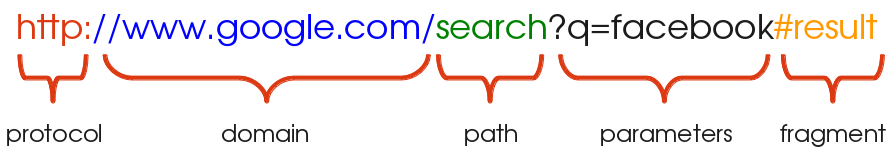

# HTTP Protocol

* Web applications are built around a client-server model where a client could be something as simple as a web browser displaying plain old HTML, a mobile application fetching and creating data or even other web services.

* Similarly, servers could be implemented in a variety of ways, using different technology stacks, languages, and serving different types of data.

* In order to accommodate this diversity, clients and servers must agree upon a set of conventions — a protocol — that dictates all communication between them. This protocol allows a web server to receive the information —-requests-— sent by an arbitrary client, process them, and respond appropriately.

* Modern day web applications use the Hypertext Transfer Protocol, commonly abbreviated to HTTP, in order to exchange information.

# URL

 URL is short for Uniform Resource Locator and is used to identify the address of a resource on the Web.

### A URL typically consists of the following components:

**Protocol:** This is the protocol that the request is served over. This is most often just HTTP (or its secure version, HTTPS).

**Domain:** This is the host name of the server the resource is being requested from.

**Path:** This is the location of the resource on the server. This may be correspond to the location of the resource within the file system (i.e. /search/files/myFile.txt) although this practice is rarely used nowadays.

**Parameters:** This is additional data, passed in the form of key-value pairs, that may be used by the server to identify the resource, or filter a list of resources.

**Fragment:** A fragment refers to a location within the resource being returned and is typically applied to documents. For example, for HTML documents the browser directly scrolls to the element identified by the anchor. Fragments are also referred to as anchors.

## Key Elements of HTTP Request

* URL

* Form Data(if any)

* HTTP Method

* Cookies (if any)

## Key Elements of HTTP Response

* Status Code

* Content Type (text/html, application/pdf, image/jpeg, application/json, many more..)

* Actual Content

* Cookies (if any)

## HTTP Method

HTTP defines a handful of methods, also called “verbs”, that a client may use in order to describe the type of request being made.

Each request can be modeled as doing a specific action on a resource. For example, a client may request to create, delete, update or simply read from a resource. In HTTP this corresponds to making POST, DELETE, PUT or GET requests respectively.

### GET

* GET is a default method.

* Usually GET request used to read the resource from server.
* Request Body won't be available.

* With GET request you can send some data to server using URL Query String.
* Insecure while sending data because form data will be present in URL & it get expose to outside world.
* Length of URL is limited to 2044 characters, meaning we cannot send too much data in query string as well.

### POST

* POST is not default. We have to explicitly declare method ="POST" while making a request.
* POST request do have a body.
* Secure because form data will be present in the body.
* There is no restriction on the amount of data sent using the POST.

### PUT 

* Used to update existing resource on server.
* Either creates or replaces the resource at the specified URI

### PATCH

* Used to perform partial update of a resource.

### DELETE

* Used to perform partial update of a resource.

## Status Code

Status codes are a useful HTTP construct that provide information to the consumer about the outcome of a request and how to interpret it. HTTP defines several status codes, each pertaining to a specific scenario. Some of the common series of codes you might encounter are listed here:

**2xx:** Status codes falling in the 2xx series imply that the request completed successfully and without errors.

**3xx:** A code in the 3xx series implies redirection. This means that the server redirected to another location on receiving the request.

**4xx:** A 4xx error, i.e. 400, 403, 404 etc. are used when there is an error in the request made. This could be caused by a variety of reasons, such as unauthorized access to a resource, trying to work with a resource that doesn’t actually exist, invalid parameters and so on.

**5xx:** Lastly, a 5xx response is used when there is an error on the server side. This means that the server is aware of the error and is incapable of processing the request.

